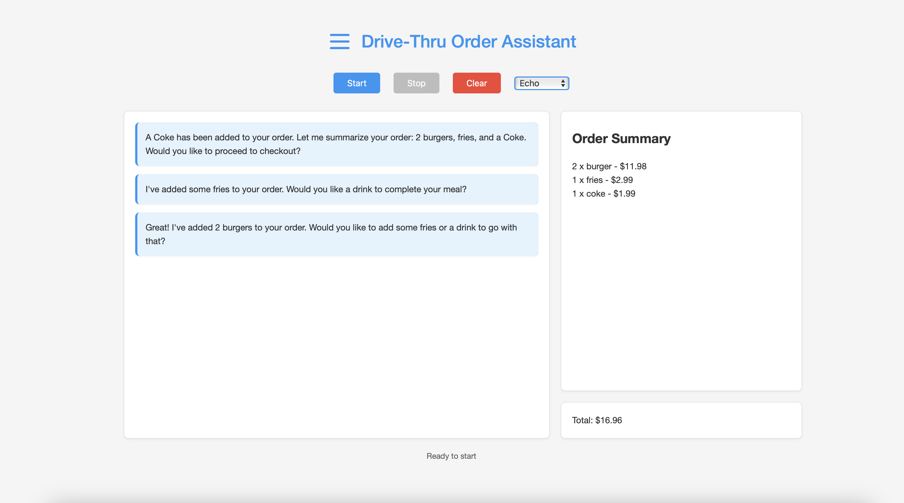

# drive-through-agent-demo



## Setup

1. Clone the repository
2. Install dependencies: `pip install -r requirements.txt`
3. Create `.env` file with your OpenAI API key:   

```bash
OPENAI_API_KEY=your-key-here
REALTIME_SESSION_URL=https://api.openai.com/v1/realtime/sessions
```

## Running

1. Start server: `python app.py`
2. Open index.html in a browser (Tip: use live server extension for VSCode)
3. Click Start and allow microphone access
4. Once the microphone is active, ask the agent to place your order (e.g., "I would like two burgers and one fries.")